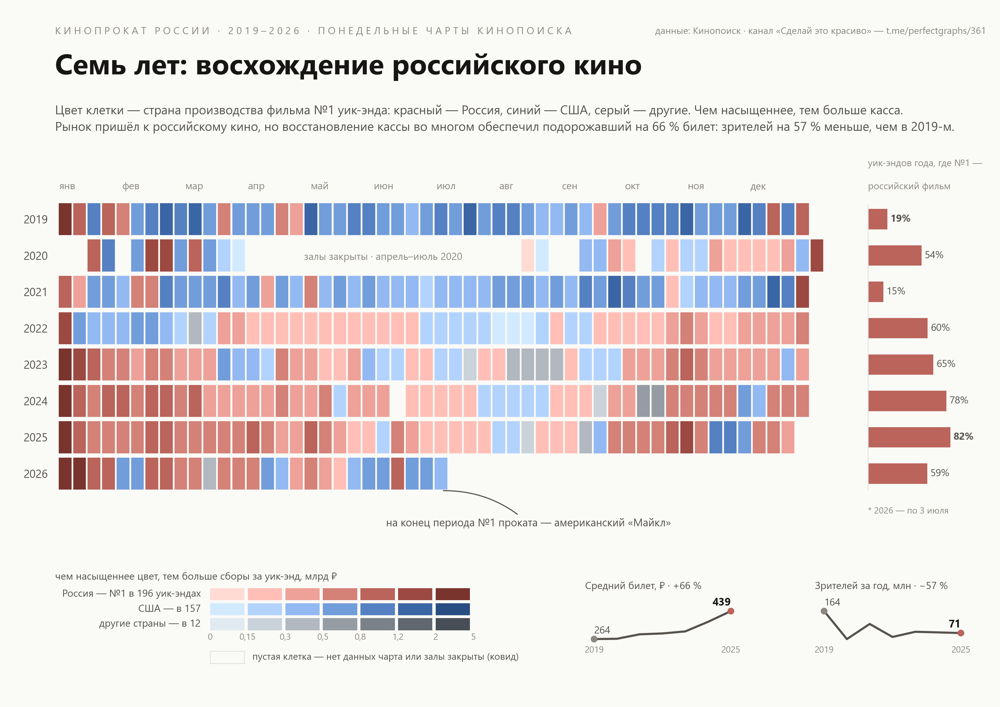

# Семь лет: восхождение российского кино



Одностраничный A4-постер на чистом **matplotlib** (без seaborn и внешних
стилей): как за семь лет российские фильмы заняли отечественный прокат.

Календарная теплокарта «год × ISO-неделя» с двухмерным цветовым кодированием:

- **оттенок клетки** — страна производства фильма №1 уик-энда
  (красный — Россия, синий — США, серый — другие страны);
- **насыщенность** — сборы всех фильмов чарта за уик-энд, млрд руб.
  Три рампы выровнены по одной лестнице светлоты OKLCH, поэтому
  одинаковый бин читается одинаково тёмным независимо от страны;
- **боковая панель** — доля уик-эндов года, где №1 — российский фильм;
- **мини-тренды** — средний билет и годовая аудитория.

## Ключевые инсайты графика

- Доля уик-эндов с российским фильмом-лидером выросла с **19 % (2019)
  до 82 % (2025)**; перелом читается на полотне с весны 2022 года.
- Самый «голливудский» год — не 2019-й, а **2021-й**: лишь 15 %
  уик-эндов за российскими фильмами.
- Рекордная серия — **26 недель подряд** с российским №1:
  с 23.09.2022 по 17.03.2023.
- В **6 из 8 лет** самый кассовый уик-энд года — первая неделя января,
  с 2022-го — пять лет подряд; абсолютный рекорд периода —
  **5,0 млрд руб.** за уик-энд 2–4 января 2026-го («Чебурашка 2»).
- Цена восхождения: средний билет **+66 %** (264 → 439 руб.),
  зрителей **−57 %** (164 → 71 млн) — доля российского кино растёт
  на заметно сжавшемся рынке.
- «Серые» лидеры — редкость, 12 уик-эндов за 7,5 лет: четыре подряд
  у «Леди Баг и Супер-Кот» (август–сентябрь 2023), концерт-фильм BTS
  (март 2022), «Граф Монте-Кристо», «Дракула», «Наследник» и др.;
  два уик-энда октября 2024-го — фильм без карточки в данных
  (film_id 5377804), отнесён к «другим» за неимением метаданных.
- **2026-й — первый разворот тренда**: за полгода доля российских
  лидерств упала до 59 %, весной синие клетки вернулись, и на конец
  периода №1 проката — американский «Майкл».
- Пустые клетки — недели без понедельного чарта: локдаун
  (апрель–июль 2020) и отдельные праздничные недели.

## Данные

Понедельные чарты кассовых сборов Кинопоиска, 04.01.2019 — 03.07.2026
(365 уик-эндов), плюс карточки фильмов со страной производства.
Датасет — из челленджа канала «Сделай это красиво»:
<https://t.me/perfectgraphs/361>.

Методология: «США» — фильмы, среди стран производства которых есть США;
«Россия» — включая копродукции. Сборы — сумма уик-эндов (пт–вс) всех
фильмов чарта, номинальные рубли. Недели — ISO-нумерация. 2026 год
неполный (по 3 июля).

## Воспроизведение

```bash
pip install pandas matplotlib
python heatmap_rise_of_russian_cinema.py
```

Скрипт читает CSV из своей папки и сохраняет
`heatmap_rise_of_russian_cinema.png` (300 dpi) и `.pdf`
(A4 landscape; ссылка на источник в титуле кликабельна в PDF).

## Файлы

| Файл | Что это |
|---|---|
| `heatmap_rise_of_russian_cinema.py` | скрипт постера (pandas + matplotlib) |
| `heatmap_rise_of_russian_cinema.png` | постер, 300 dpi |
| `heatmap_rise_of_russian_cinema.pdf` | постер, A4 landscape для печати |
| `kinopoisk_box_office_rus.csv` | понедельные чарты уик-эндов |
| `kinopoisk_films.csv` | карточки фильмов (страна, премьеры) |
| `kinopoisk_films_simple.csv` | упрощённая таблица «один фильм — одна строка» |

CSV-файлы в репозиторий не коммитятся (`*.csv` в `.gitignore`) —
скачайте их из поста челленджа и положите рядом со скриптом.
